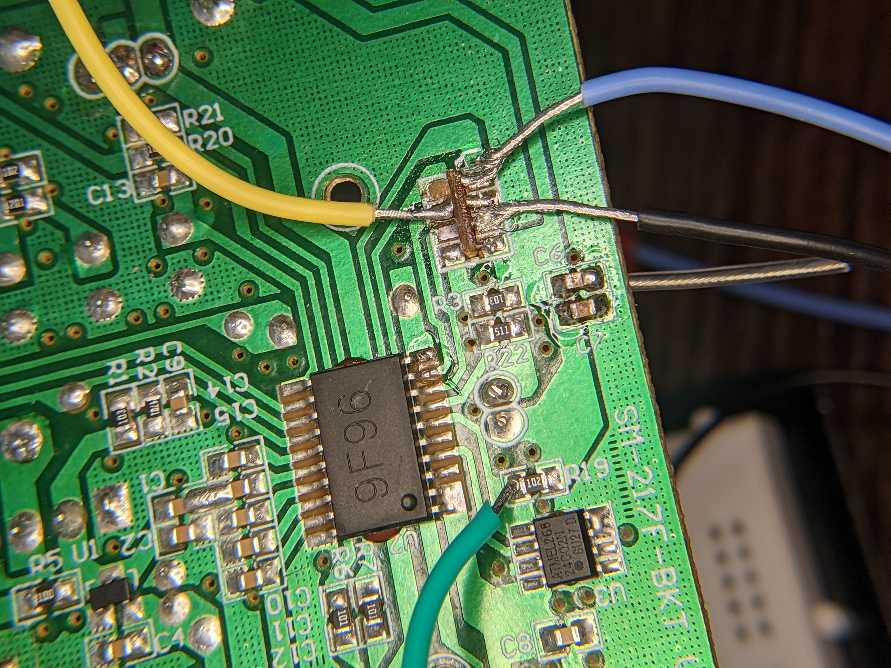

## ASyma X5C

## Resources

- http://inductivekickback.blogspot.com/2015/11/
  - this is a similar project where he thinks that the transmitter is a copy of a nRF24L01 hence the PDF in this folder
- controller_eeprom.pdf is supposedly the eeprom for the controller
- possible_ARM_datasheet.pdf is the possible datasheet for the microcontroller on the quad
- 

## Images



- The picture above shows my poor soldering job to the antenna. The blue wire represents CIPO/MISO, yellow SCK, black GND, green COPI/MOSI. By the time I got used to my new soldering iron, I partially tore the connection to CIPO/MOSI but I got lucky that the 1k resistor was connected in parallel to this pin. 

## Troubleshooting

- Permission denied when attempting to upload Arduino code to `/dev/ttyACM0`
  - Solution: in the terminal, enter the command `sudo chmod a+rw /dev/ttyACM0`

## Logs

### August 2, 2021

- Attempting to write simple transmitter and receiver programs for the NRF24L01. Combed through the entire datasheet and I just want to see if I can get both ends working.
- Started an Arduino program for the transmitter but have not had any luck with reading/writing. The Arduino SPI library is not very helpful.

### August 3, 2021

- Connecting the PicoScope to the output of the Arduino to see if it is actually doing any SPI signaling. So far, there have been no good results. 
- Connected LED to CSN pin and added some delays around setting the output to HIGH/LOW so that I could see the LED blink on and off. It did just that, but there was still no output on the PicoScope, even on the D3 channel. I must've configured somethign incorrectly with the scope. 
  - needed to modify the trigger. it was set to "rapid" but after moving it to "none" I was able to see the digital signal.
  - to properly view the digital signals, I would suggest lowering their threshold from the "select digital channels/groups" menu. Even though the signals are supposed to be 5V peak-to-peak, selecting 3V ensures good looking digital waveforms.
- Managed to get some data with the PicoScope. There is a git commit on today's date that has the Arduino code that performs this, but I've copied it below for redundancy. This transfer occurs very fast, so you have to set a trigger in PicoScope to capture it. I decided to trigger when the digital signal D3 (in my case the Chip Select Not signal) was falling AND when the D0 (MOSI data) was HIGH. Then, I started capturing and then uploaded the code to the Arduino. The capture stopped and in the separate PicoScope window for "serial decoding" I was able to see the exact two bytes that I sent out via `SPI.transfer()`. 
  - In the PicoScope software, you can only have one condition checked for each digital signal. You can also only have one condition that is rising or falling for __all__ digital signals. However, you may have as many digital signals checked for either HIGH or LOW as you please.

```c
#include <SPI.h> //https://www.arduino.cc/en/reference/SPI

//these define what pin each signal is connected to on the arduino
#define CE 10 //slave select, not controlled by SPI library
#define SCK 13
#define MOSI 11
#define MISO 12
#define CSN 9 //not controlled by SPI library

//SPI constants
#define SPI_SPEED 10000000 //this is defined to be the limit of SPI on p.47 of the NRF specification

void setup()
{
  //initializations
  SPI.begin(); //https://www.arduino.cc/en/Reference/SPIBegin
  SPI.setBitOrder(MSBFIRST);
  SPI.setDataMode(SPI_MODE0);
  pinMode(CSN, OUTPUT);
  pinMode(CE, OUTPUT);
  Serial.begin(9600);

  //initial pin settings
  digitalWrite(CSN, HIGH);
  digitalWrite(CE, LOW);
}

void loop()
{
  //according to spec: "Change to active modes only happens if CE is set high and
  //when CE is set low, the nRF24L01 returns to standby-I mode.
  digitalWrite(CE, HIGH);
  
  //write to register
  digitalWrite(CSN, LOW);
  SPI.transfer(0b00101111); //001 (write) 01111 (0x0F)
  SPI.transfer(0b01010111); //LSB of address for Data Pipe 5
  digitalWrite(CSN, HIGH);

  //read from the same register
  digitalWrite(CSN, LOW);
  int reg_value = SPI.transfer(0b00001111); //000 (read) 01111 (0x0F)
  digitalWrite(CSN, HIGH);
  SPI.end(); //https://www.arduino.cc/en/Reference/SPIEnd

  //reset the CE pin
  digitalWrite(CE, LOW);
}
```


