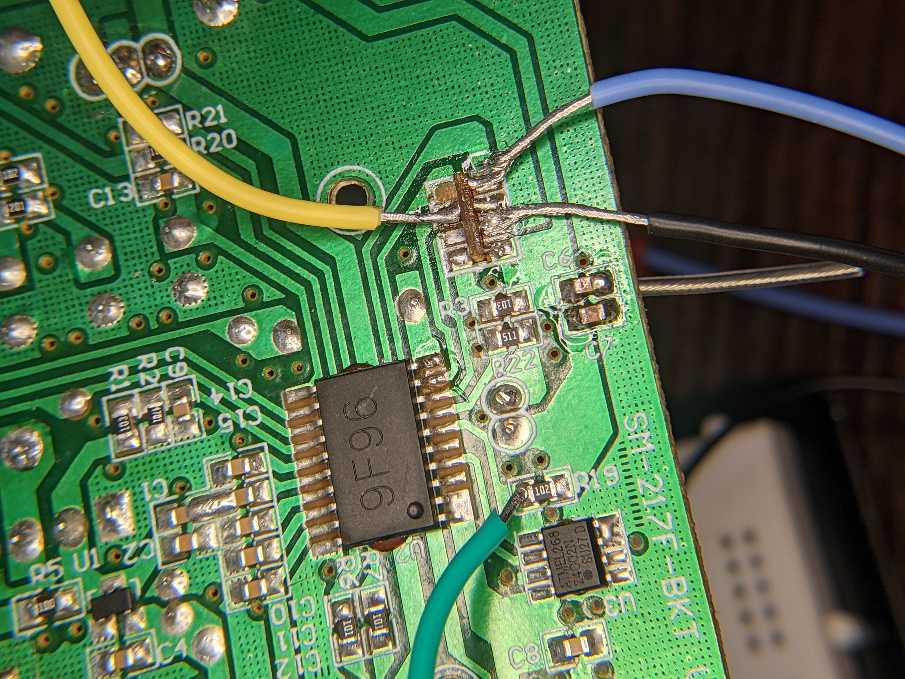

## Syma X5C

## Resources

- http://inductivekickback.blogspot.com/2015/11/
  - this is a similar project where he thinks that the transmitter is a copy of a nRF24L01
- controller_eeprom.pdf is supposedly the eeprom for the controller
- possible_ARM_datasheet.pdf is the possible datasheet for the microcontroller on the quad
- controller_circuit.asc is the LTspice model of the circuit that I made. It is not fully functional, it exists more as a blueprint than as a means of testing via software.
- nRF24L01_spec.pdf is the potential radio control specification for the transmitter.
- user_manual.pdf is the user manual for the Syma X5C quad. 

## Images

- The picture above shows my poor soldering job to the antenna. The blue wire represents CIPO/MISO, yellow SCK, black GND, green COPI/MOSI. By the time I got used to my new soldering iron, I partially tore the connection to CIPO/MOSI but I got lucky that the 1k resistor was connected in parallel to this pin. 